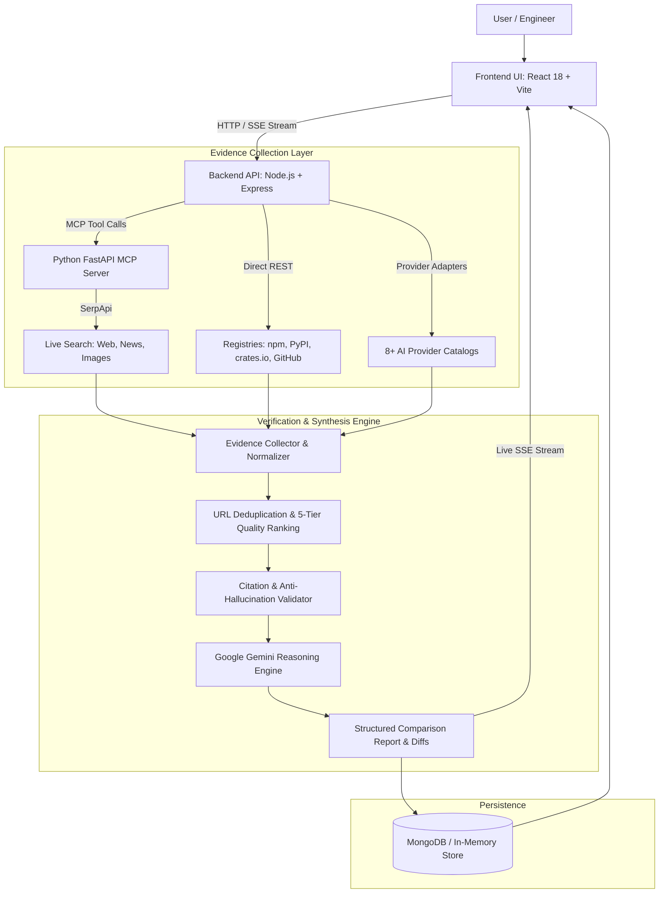

# 📚 Library Lens

> **Evidence-backed AI research assistant for software libraries and AI model intelligence.**

---

## 📋 Table of Contents

- [Overview](#-overview)
- [Problem Statement](#-problem-statement)
- [Solution](#-solution)
- [Key Features](#-key-features)
- [How It Works](#-how-it-works)
- [System Architecture](#-system-architecture)
- [Technology Stack](#-technology-stack)
- [Project Structure](#-project-structure)
- [Installation](#-installation)
- [Environment Variables](#-environment-variables)
- [Running the Project](#-running-the-project)
- [Usage](#-usage)
- [AI Model Comparison](#-ai-model-comparison)
- [Evidence & Citation System](#-evidence--citation-system)
- [Hackathon Value](#-hackathon-value)
- [Future Scope](#-future-scope)
- [Limitations](#-limitations)
- [Security](#-security)
- [Screenshots](#-screenshots)
- [Demo](#-demo)
- [Team](#-team)
- [License](#-license)

---

## 🚀 Overview

**Library Lens** is an intelligent, full-stack research and decision-support system built for software engineers, system architects, and technical decision-makers. Modern engineering teams spend countless hours evaluating software packages, validating dependencies, and navigating the rapidly changing landscape of foundation AI models against conflicting documentation, promotional benchmarks, and fragmented release notes.

Generic conversational AI models are prone to hallucinating APIs, citing outdated version numbers, and delivering unverified claims. Library Lens solves this by pairing **Google Gemini as an evidence-driven reasoning engine** with a dedicated **Python Model Context Protocol (MCP) search layer** and live registry crawlers. Every claim, capability metric, version tag, release date, and architectural trade-off is strictly validated, cross-referenced, and tied to verifiable source URLs.

---

## 🎯 Problem Statement

### 1. AI Hallucinations in Technical Architecture
Standard LLMs routinely hallucinate non-existent package methods, deprecated APIs, obsolete syntax, and fictional version numbers when answering technical questions.

### 2. Rapid AI Model Velocity & Deprecations
AI providers release, update, and deprecate models at an unprecedented rate. Engineering teams struggle to objectively compare context windows, token pricing, modality support, and real-world capabilities across providers.

### 3. Information Fragmentation
Evaluating two packages or AI models requires opening dozens of browser tabs across GitHub changelogs, package registries (npm, PyPI, crates.io), provider pricing calculators, and community forums.

### 4. Lack of Source Verification Rigor
Most developer tools and search engines present unvetted technical summaries without validating whether statements originate from official technical documentation or unverified blog posts.

### 5. Opaque and Biased Recommendations
Traditional comparison tools frequently declare arbitrary "winners" without contextual architectural analysis, empirical evidence, or an auditable trail of sources.

---

## 💡 Solution

Library Lens enforces complete grounding and transparency through a core architectural axiom:

$$\text{\bf NO SOURCE = NO FACT}$$

- **Strict Source Grounding**: Every technical claim is cross-referenced with primary documentation, package registries, and official GitHub releases. If empirical evidence cannot be retrieved, the system reports: `Insufficient verified evidence found.`
- **Side-by-Side Empirical Comparison**: Directly compares AI models and software libraries side-by-side with exact context windows, token pricing ratios, capability matrices, and evidence counts.
- **Interactive Claim Auditing**: Users can challenge any synthesized claim or recommendation to trigger targeted re-verification and counter-evidence retrieval.
- **Model Context Protocol (MCP) Architecture**: Decouples live search tools (`web_search`, `news_search`, `images_search` via SerpApi) into a dedicated Python MCP service adhering to standardized tool schemas.
- **Resilient Fallback Persistence**: MongoDB caching with an automatic, zero-configuration in-memory database fallback if MongoDB is not running locally.

---

## ✨ Key Features

### 🔍 Multi-Source Research
Performs live, multi-source technical investigation querying official documentation, GitHub releases, changelogs, and package registries (npm, PyPI, crates.io) concurrently.

### 🤖 AI Model Comparison
Provides empirical side-by-side evaluations of foundation AI models (e.g., Gemini 2.5 Flash vs. Claude 3.5 Sonnet vs. GPT-4o) comparing context limits, context ratios, 1M token input/output pricing, shared vs. unique capability diffs, and evidence citations.

### 📡 Model Context Protocol (MCP)
Integrates a dedicated Python FastAPI service implementing the Model Context Protocol to serve standardized search tools (`web_search`, `news_search`, `images_search` powered by SerpApi) to the Node.js backend.

### 🛡️ Citation Validation
Enforces an automated validation pipeline that verifies every cited source against ingested evidence. Any assertion lacking verified documentation is flagged or purged before presentation.

### ⚖️ Claim Challenge
Offers an interactive one-click audit mechanism allowing users to challenge any specific claim or recommendation, prompting the system to execute targeted counter-source research.

### 🎯 Model Recommendation Engine
Analyzes natural language prompts to extract technical constraints (context size, modalities, budget, speed) and scores candidate models with an interactive challenge workflow.

### 🔄 Model Radar & Discovery
Runs a background scheduler tracking 8+ AI provider registries (Google, OpenAI, Anthropic, Mistral, Groq, OpenRouter, Cohere, Together) to identify new, updated, and deprecated models.

### ⚡ Real-Time Progress Streaming
Delivers authentic Server-Sent Events (SSE) that stream step-by-step progress updates across query planning, registry fetches, web search execution, and Gemini synthesis.

### 📦 Dynamic Ecosystem & Typo Detection
Automatically resolves package ecosystems (`React` $\rightarrow$ npm, `FastAPI` $\rightarrow$ PyPI, `Tokio` $\rightarrow$ crates.io) and detects typos to suggest spelling candidates (`FastAPi` $\rightarrow$ `FastAPI`).

### 💾 Persistent Research & Fallback Storage
Persists research reports, model telemetry, and recommendation histories in MongoDB, with seamless automatic fallback to an embedded in-memory store.

### 📤 Multi-Format Export & Sharing
Supports exporting research reports to formatted Markdown, a print-optimized PDF view, one-click clipboard copying, and persistent shareable URLs (`/?id=...`).

---

## 🧠 How It Works



### Complete Workflow Walkthrough

1. **User Submission**: The user inputs two libraries or selects two AI models, optionally adding architectural constraints or a target use case.
2. **Query Planning & Ecosystem Resolution**: The orchestrator normalizes names, resolves package ecosystems (`npm`, `PyPI`, or `crates.io`), and generates targeted search queries.
3. **Parallel Evidence Gathering**: The backend queries package registries, GitHub release endpoints, and the Python MCP server (`web_search`, `news_search`) concurrently.
4. **Deduplication & Quality Tiering**: Collected sources are normalized, stripped of duplicates, and classified according to the 5-Tier Source Quality Hierarchy.
5. **Gemini Evidence Synthesis**: Validated evidence snippets and raw metadata are supplied to Google Gemini with strict anti-hallucination instructions.
6. **Citation Audit**: Citations generated in the report are matched against retrieved sources; unverified claims are flagged or purged.
7. **Storage & Streaming**: The verified report is cached in MongoDB (or in-memory store) and streamed in real-time to the frontend via Server-Sent Events.

---

## 🏗️ System Architecture

### Frontend
- **Framework**: React 18, Vite, TypeScript.
- **Styling**: Tailwind CSS with custom glassmorphism, responsive two-column layouts, and dark theme tokens.
- **Interactive Views**: `ModelCompareModal`, `ModelRadar`, `ModelRecommendationView`, `ClaimChallengeModal`, `ReportView`, `EvidenceGraph`, `Hero`, `Navbar`, and `Sidebar`.
- **State & Streaming**: Custom hooks (`useTheme`), Server-Sent Events client for real-time progress.

### Backend
- **Framework**: Node.js, Express, TypeScript (executed via `tsx` in development).
- **Research Orchestration**: Modular components for query planning (`planner`), content analysis (`analyzer`), execution (`orchestrator`), and name normalization (`normalizer`).
- **Evidence Management**: Dedicated modules for evidence collection (`collector`), URL deduplication (`deduplicator`), quality ranking (`ranker`), and citation cross-checking (`cross_checker`).
- **Model Intelligence**: Background scheduler (`modelScheduler`), concurrency-limited research queue, and recommendation service.

### AI Layer
- **Reasoning Engine**: Google Gemini API (`@google/generative-ai`).
- **Prompt Constraints**: Synthesis prompts strictly bound to retrieved evidence context; uncited assertions are explicitly forbidden.

### MCP Layer
- **Framework**: Python 3.10+, FastAPI, Uvicorn, Pydantic.
- **Protocol**: Model Context Protocol (MCP) tool schemas wrapping SerpApi search endpoints (`web_search`, `news_search`, `images_search`).

### External Data Sources
- **Search**: SerpApi (Google Light, Google News, Google Images).
- **Package Registries**: npm Registry API, PyPI JSON API, crates.io API.
- **Repository Metadata**: GitHub REST API (releases, tags, dates, changelogs).
- **AI Providers**: Discovery adapters for Google, OpenAI, Anthropic, Mistral, Groq, OpenRouter, Cohere, and Together AI.

### Database / Persistence
- **Primary Database**: MongoDB via Mongoose.
- **Resilient Fallback**: Automatic in-memory database store when MongoDB is unavailable, ensuring zero downtime for local testing.

### Real-Time Communication
- **Protocol**: Server-Sent Events (SSE) at `/api/research/stream/:id` delivering granular progress events to the client.

---

## 🛠️ Technology Stack

| Technology | Purpose | Implementation Details |
| :--- | :--- | :--- |
| **React 18** | Frontend UI Framework | Component-based UI, custom hooks, modal controllers |
| **Vite** | Frontend Build Tool | Fast HMR dev server and production bundling |
| **TypeScript** | Type Safety | Strict type definitions across frontend and backend |
| **Tailwind CSS** | Styling & UI Design | Utility-first CSS, dark theme tokens, glassmorphism |
| **Node.js** | Backend Runtime | Server-side execution environment |
| **Express** | Backend Web API | RESTful endpoints, SSE streaming, error handling |
| **Google Gemini API** | AI Reasoning Engine | Evidence synthesis, trade-off analysis, claim auditing |
| **Python 3.10+** | MCP Runtime | Runtime for the dedicated search tools service |
| **FastAPI & Uvicorn** | MCP Server Framework | High-performance asynchronous API for MCP tools |
| **SerpApi** | Search Service | Real-time web, news, and image discovery |
| **MongoDB & Mongoose** | Data Persistence | Document storage for reports, models, and recommendations |
| **Vitest** | Automated Testing | Unit and integration test suite for backend modules |
| **Framer Motion & Lucide** | Animation & Icons | Smooth UI transitions and modern iconography |

---

## 📁 Project Structure

```text
Library_Lens/
├── .env.example                  # Environment variable configuration template
├── .gitignore                    # Excluded dependencies, builds, and local env files
├── package.json                  # Root orchestration scripts (concurrent runner)
├── README.md                     # Project documentation
│
├── frontend/                     # React + Vite + TypeScript Frontend
│   ├── index.html                # Single-page application root HTML
│   ├── package.json              # Frontend dependencies and Vite scripts
│   ├── tailwind.config.js        # Theme tokens, font definitions, and extensions
│   ├── tsconfig.json             # TypeScript configuration for React
│   ├── vite.config.ts            # Vite bundler configuration & backend proxy
│   └── src/
│       ├── App.tsx               # Root view router and modal controllers
│       ├── index.css             # Base styles, Tailwind directives, custom scrollbars
│       ├── main.tsx              # React DOM entry point
│       ├── components/           # UI components
│       │   ├── ModelCompareModal.tsx       # AI Model Empirical Comparison UI
│       │   ├── ModelRadar.tsx              # Model discovery radar & provider stats
│       │   ├── ModelRecommendationView.tsx # Requirements-based recommender
│       │   ├── ClaimChallengeModal.tsx     # Interactive claim audit modal
│       │   ├── EvidenceGraph.tsx           # Visual evidence relationship display
│       │   ├── ReportView.tsx              # Library research comparison report
│       │   ├── Hero.tsx                    # Multi-mode research submission bar
│       │   ├── Navbar.tsx                  # Top navigation & system status
│       │   ├── Sidebar.tsx                 # Navigation between research & model tabs
│       │   └── ...
│       ├── hooks/                # Custom React hooks (e.g., useTheme)
│       ├── services/             # API clients and SSE streaming consumers
│       ├── types/                # Domain models, API responses, and evidence types
│       └── utils/                # Date formatting and source freshness evaluators
│
├── backend/                      # Node.js + Express + TypeScript Backend
│   ├── package.json              # Backend dependencies and TS scripts
│   ├── tsconfig.json             # Backend TypeScript configuration
│   └── src/
│       ├── server.ts             # Express server bootstrap and scheduler starter
│       ├── api/routes/           # Route definitions (research, models, libraries, health)
│       ├── controllers/          # Controllers for research, model catalog, recommendations
│       ├── evidence/             # Evidence collector, deduplicator, ranker, cross-checker
│       ├── gemini/               # Gemini AI reasoning and prompt synthesis engine
│       ├── mcp/                  # MCP client interface and registry fallback tools
│       ├── models/               # MongoDB Mongoose schemas, DAOs, and in-memory store
│       │   ├── providers/        # 8+ AI provider discovery adapters
│       │   ├── ai_model.schema.ts
│       │   ├── recommendation.schema.ts
│       │   └── research.schema.ts
│       ├── research/             # Orchestrator, query planner, and name normalizer
│       ├── services/             # Discovery service, recommendation engine, research queue
│       ├── tests/                # Vitest automated test suite
│       └── utils/                # Structured logger and freshness calculators
│
└── mcp-server/                   # Python Model Context Protocol (MCP) Server
    ├── requirements.txt          # Python dependencies (FastAPI, uvicorn, serpapi)
    ├── server.py                 # FastAPI MCP application (runs on port 5005)
    ├── schemas/                  # Pydantic schemas for search requests & MCP protocols
    └── tools/                    # SerpApi search tools (web_search, news_search, images_search)
```

---

## ⚙️ Installation

### Prerequisites
- **Node.js**: $\ge$ 18.0.0
- **Python**: $\ge$ 3.10
- **npm**: $\ge$ 9.0.0
- *(Optional)* **MongoDB**: Local daemon or MongoDB Atlas URI (falls back to in-memory store if not present)

---

### Step 1: Clone the Repository

```bash
git clone https://github.com/SyedAman1907/Library_Lens.git
cd Library_Lens
```

---

### Step 2: Configure Environment Variables

Create your `.env` file from the provided template:

```bash
cp .env.example .env
```

---

### Step 3: Install Node Dependencies

Install all root, backend, and frontend dependencies:

```bash
# Using root convenience script:
npm run install:all

# Or manually:
npm install
cd backend && npm install
cd ../frontend && npm install
cd ..
```

---

### Step 4: Setup Python MCP Virtual Environment

#### On Windows (PowerShell):
```powershell
cd mcp-server
python -m venv .venv
.\.venv\Scripts\activate
pip install -r requirements.txt
cd ..
```

#### On Linux / macOS:
```bash
cd mcp-server
python3 -m venv .venv
source .venv/bin/activate
pip install -r requirements.txt
cd ..
```

---

## 🔐 Environment Variables

The table below lists all supported environment variables. **Never commit actual API keys, credentials, or `.env` files to version control.**

| Variable | Purpose | Required |
| :--- | :--- | :--- |
| `PORT` | Port for the Express backend server (default: `5000`) | Optional |
| `NODE_ENV` | Application environment (`development` / `production`) | Optional |
| `CLIENT_URL` | Allowed origin for frontend CORS (default: `http://localhost:5173`) | Optional |
| `MCP_SERVER_URL` | URL of the Python MCP server (default: `http://127.0.0.1:5005`) | **Required** (for MCP search tools) |
| `SERPAPI_API_KEY` | SerpApi key for live Google Light, News, and Image research | **Required** (for live web search) |
| `GEMINI_API_KEY` | Google Gemini API key for evidence synthesis & reasoning | **Required** (for AI synthesis) |
| `GOOGLE_API_KEY` | Google AI provider discovery & live catalog health checks | Optional |
| `OPENAI_API_KEY` | OpenAI provider discovery adapter | Optional |
| `ANTHROPIC_API_KEY` | Anthropic provider discovery adapter | Optional |
| `MISTRAL_API_KEY` | Mistral AI provider discovery adapter | Optional |
| `GROQ_API_KEY` | Groq provider discovery adapter | Optional |
| `OPENROUTER_API_KEY` | OpenRouter multi-provider discovery adapter | Optional |
| `COHERE_API_KEY` | Cohere provider discovery adapter | Optional |
| `TOGETHER_API_KEY` | Together AI provider discovery adapter | Optional |
| `MODEL_SYNC_INTERVAL_HOURS` | Interval in hours for background model catalog sync (default: `6`) | Optional |
| `MAX_MODEL_RESEARCH_CONCURRENCY` | Maximum concurrent background model research jobs (default: `2`) | Optional |
| `MODEL_FRESH_HOURS` | Freshness evaluation window for model telemetry in hours (default: `24`) | Optional |
| `MODEL_AGING_HOURS` | Aging threshold before model data is flagged as stale in hours (default: `72`) | Optional |
| `MONGODB_URI` | MongoDB connection URI (falls back to in-memory store if unset/offline) | Optional |
| `GITHUB_TOKEN` | GitHub personal token to raise API rate limits from 60 to 5,000 req/hr | Optional |

> **Security Note**: Ensure `.env` is listed in `.gitignore`. If any API keys were ever committed in prior revisions, immediately revoke and rotate them in the respective provider dashboards.

---

## ▶️ Running the Project

### Option A: Run All Services Concurrently (Recommended)

From the project root:

```bash
npm run dev
```

*This uses `concurrently` to run the Python MCP server, Express backend, and Vite frontend simultaneously.*

---

### Option B: Run Services Individually

Open three separate terminals:

**Terminal 1 — Python MCP Server:**
```bash
cd mcp-server
# Windows:
.\.venv\Scripts\python.exe server.py
# Linux/macOS:
source .venv/bin/activate && python server.py
# Running on http://127.0.0.1:5005
```

**Terminal 2 — Express Backend:**
```bash
cd backend
npm run dev
# Running on http://localhost:5000
```

**Terminal 3 — React Frontend:**
```bash
cd frontend
npm run dev
# Running on http://localhost:5173
```

Open `http://localhost:5173` in your browser.

---

## 🧪 Usage

### 1. Software Library Research Workflow
1. Open the application at `http://localhost:5173`.
2. In the research bar, enter **Library A** (e.g., `Zustand`) and **Library B** (e.g., `Redux Toolkit`).
3. Enter an optional **Target Use Case & Architecture Constraints** (e.g., `High-frequency state updates in a desktop app`).
4. Click **Research**.
5. Watch the live Server-Sent Events progress stream as Library Lens gathers package metadata, inspects GitHub releases, executes MCP searches, and runs Gemini synthesis.
6. Review the synthesized comparison report: feature matrix, breaking changes, architectural trade-offs, and verified citations.
7. Click **Audit / Challenge Claim** on any assertion to launch a real-time counter-evidence audit.

---

### 2. AI Model Empirical Comparison Workflow
1. Open the **Model Radar** tab or click **Compare** on any model card.
2. Select **Model A** from the first dropdown (e.g., `[GOOGLE] Gemini 2.5 Flash`).
3. Select **Model B** from the second dropdown (e.g., `[GOOGLE] Gemini 2.5 Pro`).
4. View the side-by-side comparison cards:
   - **Context Window Limits & Ratio**
   - **Input & Output Pricing per 1M tokens**
   - **Capabilities Diff** (shared capabilities vs. unique to Model A or Model B)
   - **Verified Documentation Citations**

---

### 3. Model Recommendation Workflow
1. Navigate to **AI Recommender** in the navigation bar.
2. Enter your project's natural language requirements (e.g., `Fast multilingual translation model with structured JSON output and low latency under $1 per million tokens`).
3. View ranked model suggestions with suitability scores and constraint matching breakdowns.
4. Click **Challenge Recommendation** to audit the recommendation against fresh web evidence.

---

## 📊 AI Model Comparison

The side-by-side model comparison engine evaluates empirical specifications across models:

| Comparison Metric | Description | Source of Truth |
| :--- | :--- | :--- |
| **Provider** | Identifies the foundation AI vendor (Google, OpenAI, Anthropic, etc.) | Provider API Registry |
| **Context Window** | Evaluates total token context limit (e.g., 1.0M tokens) | Ingested Model Telemetry |
| **Context Ratio** | Calculates relative context scale factor ($Ratio = \frac{\text{Context}_A}{\text{Context}_B}$) | Computed in Backend |
| **Input Pricing** | Price per 1 million input tokens (USD) | Published Provider Pricing |
| **Output Pricing** | Price per 1 million output tokens (USD) | Published Provider Pricing |
| **Shared Capabilities** | Set intersection of verified features ($\text{Caps}_A \cap \text{Caps}_B$) | Computed Capability Matrix |
| **Unique Capabilities** | Features unique to Model A or Model B | Computed Capability Matrix |
| **Lifecycle Status** | Model availability flag (`NEW`, `UPDATED`, `ACTIVE`, `DEPRECATED`) | Provider Status Feed |
| **Evidence Citations** | Count and URLs of primary documentation citations backing the model | Evidence Ingestion Layer |

---

## 🛡️ Evidence & Citation System

Library Lens enforces an evidence validation pipeline to eliminate AI hallucinations:

### 1. 5-Tier Source Quality Hierarchy
Sources are classified by authority and reliability:

- **Tier 1 — Primary Technical Evidence**: Official documentation domains (`.dev`, `docs.*`, `/docs`), official release notes, changelogs, migration guides, and official GitHub repositories.
- **Tier 2 — Package Registries & Official Blogs**: Registry metadata from `npmjs.com`, `pypi.org`, `crates.io`, `maven.org`, `nuget.org`, and verified corporate engineering blogs (e.g., `github.blog`).
- **Tier 3 — Technical News & Industry Media**: Technical journalism outlets (e.g., InfoQ, The New Stack, DevClass).
- **Tier 4 & 5 — Community & Web Sources**: General web references and developer discussion forums.

### 2. Citation Validation Pipeline
- Every claim synthesized by Gemini must include valid source ID citations.
- The `validateReportCitations` module cross-checks every cited ID against the verified source map.
- Any fabricated or unmapped source ID is purged (`invalidSourceIdsPurged++`).
- Claims backed by verified sources receive a confidence rating ($0.95$); claims lacking sources are flagged as `UNVERIFIED` with the explanation: `No sufficient verified evidence was found.`

### 3. Source Freshness Scoring
- **Fresh**: Documentation updated within the last 6 months.
- **Recent**: Updated within 12 months.
- **Older**: Updated within 24 months.
- **Potentially Stale**: Content older than 2 years, prompting warnings on the UI.

---

## 🏆 Hackathon Value

- **Innovation**: Pairs the Model Context Protocol (MCP) with Gemini reasoning to create a reproducible, citation-grounded research pipeline rather than an unverified chatbot.
- **Practical Impact**: Eliminates costly architectural mistakes caused by hallucinated AI answers, saving developers hours of manual documentation cross-referencing.
- **Technical Depth**: Full-stack multi-service architecture coordinating Node.js/Express, Python/FastAPI MCP, React 18, Server-Sent Events, and dual-layer database fallback.
- **Scalability**: Decoupled MCP tool architecture enables adding new search providers, private documentation crawlers, or registry scrapers without altering core synthesis logic.
- **Real-World Applications**: Engineering due diligence, architecture decision records (ADRs), tech stack migrations, and AI model vendor evaluations.

---

## 🔮 Future Scope

The following items are planned enhancements:

- [ ] **Live Inference Benchmarking**: Running identical evaluation prompts against Model A and Model B in real-time to compute empirical latency and tokens-per-second generation speeds.
- [ ] **Self-Hosted Provider Adapters**: Local Ollama and vLLM discovery adapters for air-gapped on-premise model comparisons.
- [ ] **CI/CD Breaking Change Linter**: GitHub Action to audit package dependency updates in pull requests against Library Lens breaking change data.
- [ ] **Collaborative Workspaces**: Multi-user shared research collections and team-wide architectural decision records.

---

## ⚠️ Limitations

- **API Rate Limits**: GitHub API lookups without a configured `GITHUB_TOKEN` are limited to 60 requests/hour (increased to 5,000 requests/hour with token).
- **SerpApi Dependency**: Live web and news searches require active SerpApi credits and network connectivity.
- **Pricing Telemetry Sync**: Model pricing reflects values ingested during periodic synchronization and may lag unannounced intraday price adjustments.
- **Metadata-Driven Model Comparison**: Current model comparison evaluates empirical documented specifications and telemetry rather than executing live client-side inference queries simultaneously.

---

## 🔒 Security

- **Server-Side API Key Isolation**: All third-party credentials (`SERPAPI_API_KEY`, `GEMINI_API_KEY`, provider keys) are restricted to backend execution and are never sent to the client browser.
- **Log Sanitization**: The structured logger automatically scrubs sensitive keys, tokens, and database passwords before outputting logs.
- **Safe External Navigation**: All outbound source links use `rel="noopener noreferrer"` attributes to prevent tab-nabbing vulnerabilities.
- **Input Validation**: API parameters and search queries are strictly validated using Zod schemas and query sanitizers.
- **Repository Safety**: `.env` files are excluded by `.gitignore`.

---

## 📸 Screenshots

Screenshots will be added here.
## 📄 License

This project is licensed under the [MIT License](package.json).

---

## ⭐ Final Section

**Library Lens brings empirical rigor to AI-assisted software engineering — transforming generative AI from an unreliable memory bank into a verifiable, evidence-grounded research partner.**
