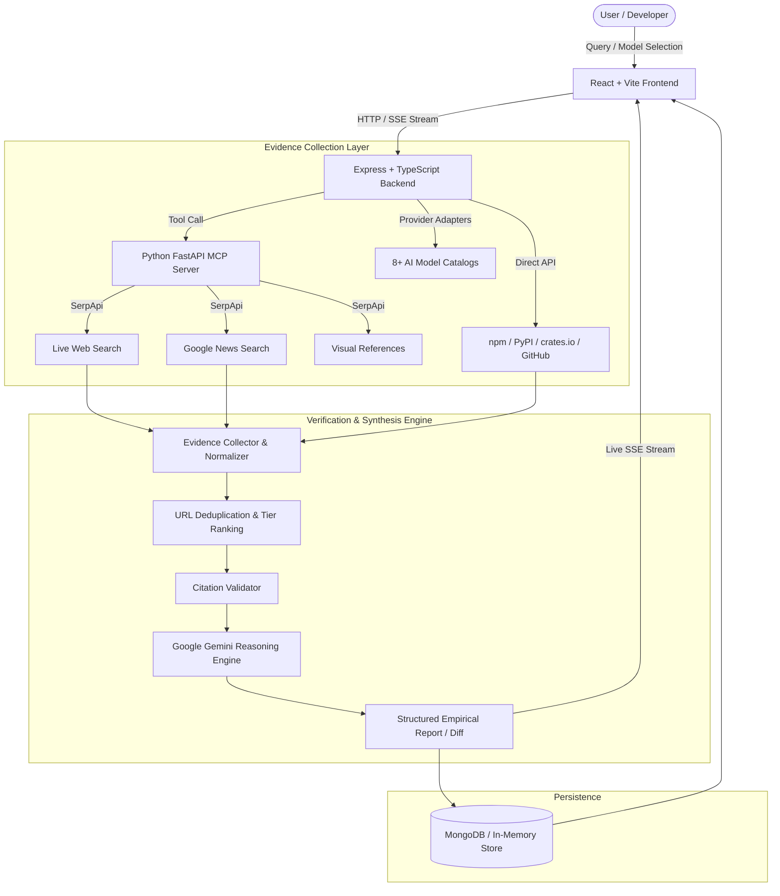

# LibraryLens AI

> **Evidence-backed AI research assistant and empirical model intelligence platform powered by Google Gemini, the Model Context Protocol (MCP), and multi-source verification.**

---

## 🚀 Overview

**LibraryLens AI** is an intelligent full-stack research and decision-support system designed for software engineers, tech leads, and system architects. Modern engineering teams waste hours evaluating frameworks, validating software packages, and comparing rapidly evolving AI models against conflicting documentation, marketing claims, and outdated benchmarks. 

Instead of relying on static AI memory or unverifiable conversational outputs, LibraryLens AI pairs **Google Gemini as an evidence-driven reasoning engine** with a dedicated **Model Context Protocol (MCP) search layer** and live registry crawlers. Every claim, capability metric, release date, and architectural trade-off is cross-referenced with real-time official documentation, package registries, GitHub changelogs, and empirical provider telemetry.

---

## 🎯 Problem Statement

1. **AI Hallucinations in Technical Decision-Making**: Standard LLMs routinely hallucinate non-existent APIs, deprecated syntax, obsolete version numbers, and inaccurate pricing or context limits.
2. **Rapid AI Model Velocity**: AI providers release, update, and deprecate models at an unprecedented pace. Engineering teams struggle to objectively compare capabilities, token pricing, and context windows across providers.
3. **Information Fragmentation**: Assessing two libraries or models requires opening dozens of tabs across GitHub releases, package registries (npm, PyPI, crates.io), pricing calculators, and community forums.
4. **Unverifiable "Best" Claims**: Most comparison tools declare arbitrary winners without empirical evidence, architectural context, or citations that can be independently audited.

---

## 💡 Solution

LibraryLens AI enforces a strict architectural principle:

$$\text{\bf NO SOURCE = NO FACT}$$

- **Grounding in Verified Evidence**: Claims are validated against primary sources (official documentation, GitHub tags, npm/PyPI/crates metadata, official release notes). If evidence cannot be retrieved, the system reports: `Insufficient verified evidence found.`
- **Empirical AI Model Comparison**: Side-by-side technical evaluation of model capabilities (context window ratio, input/output pricing per 1M tokens, feature diffs, and documented citations).
- **Interactive Claim Challenge**: Users can challenge any synthesized claim or model recommendation, prompting the system to perform targeted counter-source research and update the assessment.
- **Model Context Protocol (MCP) Layer**: A decoupled Python service exposing standard MCP tools (`web_search`, `news_search`, `images_search` via SerpApi) to supply real-time web evidence to the Node.js backend.
- **Resilient Multi-Tier Persistence**: MongoDB caching with automatic, seamless fallback to an in-memory database if no local MongoDB instance is present.

---

## ✨ Key Features

- **Live Multi-Source Library Research**: In-depth comparison of two libraries for specific use cases (e.g., high-throughput microservices, state management, dashboard scalability).
- **Empirical AI Model Comparison**: Side-by-side comparison of AI models (e.g., Gemini 2.5 Flash vs. Claude 3.5 Sonnet vs. GPT-4o) showing exact context windows, pricing, capability diffs, and evidence sources.
- **AI Model Radar & Autonomous Sync**: Background scheduler that synchronizes with 8+ AI provider registries (Google, OpenAI, Anthropic, Mistral, Groq, OpenRouter, Cohere, Together) to detect new, updated, and deprecated models.
- **Model Recommendation Engine**: Natural language requirements analyzer that extracts constraints (modality, latency, context size, budget) and scores candidates with an interactive counter-evidence challenge mechanism.
- **Strict 5-Tier Citation Hierarchy**: Evaluates source reliability across primary technical docs, package registries, company announcements, tech media, and community sources.
- **Citation Validation & Anti-Hallucination Filter**: Post-processing validation that purges unverified citations or mismatched claims before client presentation.
- **Interactive Claim Audit & Challenge**: One-click claim challenging that triggers targeted re-verification against web sources to confirm or refute statements.
- **Real-Time Progress Streaming**: Authentic Server-Sent Events (SSE) stream backend progress across research planning, registry queries, search execution, and Gemini synthesis.
- **Dynamic Ecosystem & Typo Detection**: Automatically identifies package ecosystems (npm, PyPI, crates.io) and suggests spelling corrections (e.g., `FastAPi` $\rightarrow$ `FastAPI`, `Reac` $\rightarrow$ `React`).
- **Research Version History & Replay**: Tracks report revisions over time and allows stepping through intermediate research artifacts.
- **Export & Shareability**: Multi-format exports including Markdown, PDF print stylesheet, clipboard copying, and shareable deep links (`/?id=...`).

---

## 🧠 How It Works



### End-to-End Workflow

1. **Input Submission**: The user submits two libraries or selects two AI models for comparison, optionally specifying architectural constraints or use-case requirements.
2. **Query Planning & Ecosystem Resolution**: The orchestrator normalizes library names, resolves the package registry (npm, PyPI, or crates.io), and formulates targeted search queries.
3. **Parallel Evidence Gathering**: The backend queries package registries, GitHub release tags, and the Python MCP server (`web_search`, `news_search`) concurrently.
4. **Deduplication & Quality Tiering**: Collected sources are normalized, deduplicated, and ranked against the 5-Tier Source Quality Hierarchy.
5. **Gemini Evidence Synthesis**: Validated evidence snippets and raw metadata are supplied to Google Gemini with strict prompt constraints forbidding uncited facts.
6. **Citation Audit**: Citations are verified against the ingested source list; any unverified assertions are purged or flagged.
7. **Storage & Streaming**: The final structured report is cached in MongoDB (or in-memory store) and rendered in real-time on the frontend via SSE.

---

## 🏗️ System Architecture

### 1. Frontend
- **Framework**: React 18 with Vite and TypeScript.
- **Styling**: Tailwind CSS with custom glassmorphism, responsive two-column layouts, and dark mode palette.
- **State & Data Handling**: Custom hooks (`useTheme`), Server-Sent Events client for real-time progress, and modular views (`Hero`, `ReportView`, `ModelRadar`, `ModelRecommendationView`, `ModelCompareModal`).
- **Icons & Animation**: Lucide React and Framer Motion.

### 2. Backend
- **Framework**: Node.js with Express and TypeScript (executed via `tsx` in development).
- **Orchestration**: Specialized modules for research orchestration (`planner`, `analyzer`, `orchestrator`, `normalizer`), evidence management (`collector`, `deduplicator`, `ranker`, `cross_checker`), and citation validation.
- **Model Intelligence**: Background scheduler (`modelScheduler`) running periodic syncs across AI providers, a research queue with configurable concurrency, and a recommendation engine.

### 3. AI / ML Components
- **Reasoning Engine**: Google Gemini API (`@google/generative-ai`) used for structured evidence extraction, technical trade-off evaluation, claim verification, and requirements-to-model matching.
- **Prompt Constraints**: Zero-shot and few-shot prompts strictly conditioned on supplied evidence context.

### 4. APIs
- **REST Endpoints**:
  - `/api/research`: Initiate research, retrieve reports, view sources, inspect evidence, challenge claims, review versions, and replay steps.
  - `/api/library`: Package registry metadata and GitHub release tags.
  - `/api/models`: Model listing, radar telemetry, manual/scheduled sync, side-by-side comparison, notifications, and recommendations.
  - `/api/health`: Comprehensive system health diagnostics (MongoDB, MCP server, Gemini API).
- **Streaming**: Server-Sent Events (SSE) at `/api/research/stream/:id`.

### 5. Database
- **Primary**: MongoDB via Mongoose.
- **Fallback**: Automatic in-memory storage fallback when MongoDB is unavailable, ensuring zero disruption during local development and testing.

### 6. External Services
- **Google Gemini API**: Synthesizes verified technical insights and analyzes model recommendations.
- **SerpApi via Python MCP**: Real-time Google Light web search, Google News, and image lookups.
- **Open Package Registries**: npm Registry API, PyPI JSON API, and crates.io API.
- **GitHub REST API**: Release tags, published dates, and changelogs.
- **AI Provider Catalogs**: Discovery adapters for Google, OpenAI, Anthropic, Mistral, Groq, OpenRouter, Cohere, and Together AI.

### 7. Data Flow
Raw user intent $\rightarrow$ Orchestrator $\rightarrow$ MCP Tools & Registries $\rightarrow$ Evidence Collector $\rightarrow$ Tier Ranker $\rightarrow$ Citation Validator $\rightarrow$ Gemini Synthesis $\rightarrow$ Persistence $\rightarrow$ SSE Stream to Client.

---

## 🛠️ Tech Stack

| Technology | Purpose |
| :--- | :--- |
| **React 18** | Frontend user interface and component architecture |
| **Vite** | Fast development server and frontend bundling |
| **TypeScript** | Type safety across frontend, backend, and shared domain models |
| **Tailwind CSS** | Styling, glassmorphic UI components, and dark theme |
| **Node.js & Express** | Core API gateway, research orchestration, and provider management |
| **Google Gemini API** | Grounded reasoning, technical synthesis, and claim evaluation |
| **Python 3.10+ & FastAPI** | Model Context Protocol (MCP) server wrapping search tools |
| **SerpApi** | Live search engine queries (Google Light, Google News, Google Images) |
| **Mongoose & MongoDB** | Persistence for research reports, model telemetry, and recommendations |
| **Vitest** | Automated backend unit and integration testing suite |
| **Framer Motion & Lucide** | Micro-interactions, transitions, and iconography |

---

## 📁 Project Structure

```text
LensAi/
├── .env.example                  # Environment variable template
├── .gitignore                    # Excluded dependencies, builds, and keys
├── package.json                  # Root orchestration scripts (concurrent dev runner)
├── README.md                     # Project documentation
│
├── frontend/                     # React + Vite + TypeScript Frontend
│   ├── index.html                # Single-page application root HTML
│   ├── package.json              # Frontend dependencies and Vite scripts
│   ├── tailwind.config.js        # Theme tokens, font definitions, and extensions
│   ├── tsconfig.json             # TypeScript configuration for React
│   ├── vite.config.ts            # Vite bundler configuration & backend proxy
│   └── src/
│       ├── App.tsx               # Root view router and modal controllers
│       ├── index.css             # Base styles, Tailwind directives, custom scrollbars
│       ├── main.tsx              # React DOM entry point
│       ├── components/           # UI components
│       │   ├── ModelCompareModal.tsx       # AI Model Empirical Comparison UI
│       │   ├── ModelRadar.tsx              # Model discovery radar & provider stats
│       │   ├── ModelRecommendationView.tsx # Requirements-based recommender
│       │   ├── ClaimChallengeModal.tsx     # Interactive claim audit modal
│       │   ├── EvidenceGraph.tsx           # Visual evidence relationship display
│       │   ├── ReportView.tsx              # Library research comparison report
│       │   ├── Hero.tsx                    # Multi-mode research submission bar
│       │   ├── Navbar.tsx                  # Top navigation & system status
│       │   ├── Sidebar.tsx                 # Navigation between research & model tabs
│       │   └── ...
│       ├── hooks/                # Custom React hooks (e.g., useTheme)
│       ├── services/             # API clients and SSE streaming consumers
│       ├── types/                # Domain models, API responses, and evidence types
│       └── utils/                # Date formatting and source freshness evaluators
│
├── backend/                      # Node.js + Express + TypeScript Backend
│   ├── package.json              # Backend dependencies and TS scripts
│   ├── tsconfig.json             # Backend TypeScript configuration
│   └── src/
│       ├── server.ts             # Express server bootstrap and scheduler starter
│       ├── api/routes/           # Route definitions (research, models, libraries, health)
│       ├── controllers/          # Controllers for research, model catalog, recommendations
│       ├── evidence/             # Evidence collector, deduplicator, ranker, cross-checker
│       ├── gemini/               # Gemini AI reasoning and prompt synthesis engine
│       ├── mcp/                  # MCP client interface and registry fallback tools
│       ├── models/               # MongoDB Mongoose schemas, DAOs, and in-memory store
│       │   ├── providers/        # 8+ AI provider discovery adapters
│       │   ├── ai_model.schema.ts
│       │   ├── recommendation.schema.ts
│       │   └── research.schema.ts
│       ├── research/             # Orchestrator, query planner, and name normalizer
│       ├── services/             # Discovery service, recommendation engine, research queue
│       ├── tests/                # Vitest automated test suite
│       └── utils/                # Structured logger and freshness calculators
│
└── mcp-server/                   # Python Model Context Protocol (MCP) Server
    ├── requirements.txt          # Python dependencies (FastAPI, uvicorn, serpapi)
    ├── server.py                 # FastAPI MCP application (runs on port 5005)
    ├── schemas/                  # Pydantic schemas for search requests & MCP protocols
    └── tools/                    # SerpApi search tools (web_search, news_search, images_search)
```

---

## ⚙️ Installation

### Prerequisites
- **Node.js**: $\ge$ 18.0.0
- **Python**: $\ge$ 3.10
- **npm**: $\ge$ 9.0.0
- *(Optional)* **MongoDB**: Local daemon or MongoDB Atlas URI (falls back to in-memory store if not installed)

---

### Step 1: Clone Repository & Create Environment File

```bash
git clone <repository-url>
cd LensAi
cp .env.example .env
```

---

### Step 2: Install Node.js Dependencies

Install all root, backend, and frontend dependencies:

```bash
# Using the root convenience script:
npm run install:all

# Or manually:
npm install
cd backend && npm install
cd ../frontend && npm install
cd ..
```

---

### Step 3: Setup Python MCP Server Virtual Environment

#### On Windows (PowerShell):
```powershell
cd mcp-server
python -m venv .venv
.\.venv\Scripts\activate
pip install -r requirements.txt
cd ..
```

#### On Linux / macOS:
```bash
cd mcp-server
python3 -m venv .venv
source .venv/bin/activate
pip install -r requirements.txt
cd ..
```

---

## 🔐 Environment Variables

Configure the following variables in the root `.env` file. **Never commit actual API keys or credentials to source control.**

| Variable | Purpose | Required |
| :--- | :--- | :--- |
| `PORT` | Port for the Express backend server (default: `5000`) | Optional |
| `NODE_ENV` | Application environment (`development` / `production`) | Optional |
| `CLIENT_URL` | Allowed origin for frontend CORS (default: `http://localhost:5173`) | Optional |
| `MCP_SERVER_URL` | URL of the Python MCP server (default: `http://127.0.0.1:5005`) | **Required** (for MCP search tools) |
| `SERPAPI_API_KEY` | SerpApi key for live Google Light, News, and Image research | **Required** (for live web search) |
| `GEMINI_API_KEY` | Google Gemini API key for evidence synthesis & reasoning | **Required** (for AI synthesis) |
| `GOOGLE_API_KEY` | Google AI provider discovery & live catalog health checks | Optional |
| `OPENAI_API_KEY` | OpenAI provider discovery adapter | Optional |
| `ANTHROPIC_API_KEY` | Anthropic provider discovery adapter | Optional |
| `MISTRAL_API_KEY` | Mistral AI provider discovery adapter | Optional |
| `GROQ_API_KEY` | Groq provider discovery adapter | Optional |
| `OPENROUTER_API_KEY` | OpenRouter multi-provider discovery adapter | Optional |
| `COHERE_API_KEY` | Cohere provider discovery adapter | Optional |
| `TOGETHER_API_KEY` | Together AI provider discovery adapter | Optional |
| `MODEL_SYNC_INTERVAL_HOURS` | Interval in hours for background model catalog synchronization (default: `6`) | Optional |
| `MAX_MODEL_RESEARCH_CONCURRENCY` | Maximum concurrent background model research jobs (default: `2`) | Optional |
| `MODEL_FRESH_HOURS` | Freshness evaluation window for model telemetry in hours (default: `24`) | Optional |
| `MODEL_AGING_HOURS` | Aging threshold before model data is flagged as stale in hours (default: `72`) | Optional |
| `MONGODB_URI` | MongoDB connection URI (falls back to in-memory store if unset/offline) | Optional |
| `GITHUB_TOKEN` | GitHub personal token to raise API rate limits from 60 to 5,000 req/hr | Optional |

---

## ▶️ Running the Project

### Option A: Run All Services Concurrently (Recommended)

From the project root:

```bash
npm run dev
```

*This launches the Python MCP server, the Express backend, and the Vite frontend concurrently.*

---

### Option B: Run Services Individually

If preferred, open three separate terminal windows:

**Terminal 1 — Python MCP Server:**
```bash
cd mcp-server
# Windows:
.\.venv\Scripts\python.exe server.py
# Linux/macOS:
source .venv/bin/activate && python server.py
# Server starts on http://127.0.0.1:5005
```

**Terminal 2 — Express Backend:**
```bash
cd backend
npm run dev
# Server starts on http://localhost:5000
```

**Terminal 3 — React Frontend:**
```bash
cd frontend
npm run dev
# Application opens at http://localhost:5173
```

Open `http://localhost:5173` in your browser.

---

## 🧪 Example Usage

### 1. AI Model Empirical Comparison
The application features a dedicated side-by-side empirical comparison view:

1. **Navigate to Comparison**: Open the **Model Radar** or **AI Models** view from the sidebar, or trigger **Compare** on any model card.
2. **Select Model A**: Choose the baseline model from the dropdown (e.g., `[GOOGLE] Gemini 2.5 Flash`).
3. **Select Model B**: Choose the target model from the second dropdown (e.g., `[GOOGLE] Gemini 2.5 Pro` or any discovered provider model).
4. **Run Empirical Comparison**: The system executes `POST /api/models/compare` with both model identifiers.
5. **Inspect Side-by-Side Metrics**:
   - **Context Window Ratio**: Displays exact token limits (e.g., `1.0M vs 1.0M`) and calculated ratio (`Ratio: 1.00x`).
   - **Token Pricing**: Compares Input Pricing and Output Pricing per 1M tokens side-by-side.
   - **Capabilities Diff**: Visual breakdown of shared capabilities (e.g., Text, Streaming, Long Context) vs. unique capabilities present exclusively in Model A or Model B.
   - **Evidence Citations**: Compares verified evidence citations retrieved for both models.
6. **Analyze Model Fit**: Use the telemetry cards and overview descriptions to make informed architectural selections based on verified specs rather than marketing claims.

---

### 2. Software Library Research
1. Enter **Library A** (e.g., `Zustand`) and **Library B** (e.g., `Redux Toolkit`).
2. Specify an optional **Use Case** (e.g., `High-frequency state updates in an electron desktop app`).
3. Click **Research**.
4. Watch the real-time SSE progress stream gather package metadata, inspect GitHub release tags, run web searches via MCP, and synthesize the grounded report.
5. Review the objective trade-offs, architecture comparisons, and verified citation badges. Click **Audit / Challenge Claim** on any assertion to verify against primary sources.

---

## 📊 Evaluation / Comparison

The application provides objective, empirical comparisons across two major domains:

### 1. AI Model Comparison Metrics
- **Context Window Limits & Ratio**: Evaluates maximum context window sizes and computes the numerical scale factor ($Ratio = \frac{\text{Context}_A}{\text{Context}_B}$).
- **Token Pricing per 1M Tokens**: Evaluates standard input and output token costs based on published provider pricing.
- **Capabilities Matrix**: Computes the set intersection and set differences:
  - $\text{Shared} = \text{Caps}_A \cap \text{Caps}_B$
  - $\text{Unique to A} = \text{Caps}_A \setminus \text{Caps}_B$
  - $\text{Unique to B} = \text{Caps}_B \setminus \text{Caps}_A$
- **Lifecycle & Provider Status**: Categorizes models as `NEW`, `UPDATED`, `ACTIVE`, or `DEPRECATED`.
- **Evidence Count**: Quantifies verified documentation citations backing each model's capability claims.

### 2. Software Library Comparison Metrics
- **Registry Telemetry**: Compares published version, release dates, weekly download numbers, and license types.
- **Source Quality Classification**: Evaluates each supporting source against a 5-tier credibility hierarchy.
- **Freshness Scoring**: Flags documentation as *Fresh* (< 6 months), *Recent* (< 1 year), *Older* (< 2 years), or *Potentially Stale*.
- **Claim Challengeability**: Every synthesized fact provides an audit trail back to its originating HTTP source URL.

---

## 🏆 Hackathon Value

- **Solves a Universal Problem**: Developers make critical architectural choices using outdated blog posts, biased benchmarks, and hallucinated LLM advice. LibraryLens AI grounds technical decisions in verifiable reality.
- **True Multi-Model & MCP Architecture**: Demonstrates practical adoption of the Model Context Protocol (MCP) to decouple live search tools from core business logic.
- **Zero Hallucination Tolerance**: Eliminates "black box" claims through programmatic citation validation and interactive claim challenge workflows.
- **Production-Grade Resilience**: Built with automatic in-memory fallback stores, asynchronous concurrency queues, and real-time streaming interfaces.

---

## 🔮 Future Scope

The following capabilities represent planned enhancements not currently implemented in the codebase:

- [ ] **Automated Head-to-Head Benchmark Execution**: Running live coding/reasoning prompts against Model A and Model B in real-time to compute empirical latency and token generation rates.
- [ ] **Self-Hosted LLM Provider Adapters**: Local Ollama and vLLM discovery adapters for air-gapped on-premise model comparisons.
- [ ] **CI/CD Breaking Change Linter**: GitHub Action to audit dependencies in pull requests against LibraryLens breaking change radar.
- [ ] **Collaborative Workspace Teams**: Multi-user shared research collections and team-wide architectural decision records (ADRs).

---

## ⚠️ Limitations

- **API Rate Limits**: Package registry lookups and GitHub API queries are subject to upstream rate limits (mitigated by configuring `GITHUB_TOKEN`).
- **SerpApi Dependency**: Live web and news searches require an active SerpApi connection and API credits.
- **Provider Pricing Currency**: Model pricing data reflects values ingested from provider documentation at synchronization time and may lag unannounced intraday price cuts.
- **Browser-Only LLM Inference**: The current model comparison compares documented empirical specifications and metadata rather than executing live client-side inference queries against both models simultaneously.

---

## 🔒 Security

- **Strict Server-Side Key Isolation**: All third-party credentials (`SERPAPI_API_KEY`, `GEMINI_API_KEY`, provider API keys) remain exclusively on the backend server and are never delivered to the client browser.
- **Automated Log Sanitization**: The backend structured logger automatically scrubs potential API keys, authorization headers, and database connection strings before writing to stdout.
- **Safe External Navigation**: All outbound source citations open with explicit `rel="noopener noreferrer"` attributes to prevent tab-nabbing vulnerabilities.
- **Input Sanitization**: Research parameters and search strings are validated via Zod schemas and query planners to prevent injection attacks.

---

## 🎥 Demo

- **Demo Video**: *[Link to 2-3 minute presentation video]*
- **Live Deployment**: *[Link to live deployed web application]*
- **GitHub Repository**: *[Link to official GitHub repository]*

---

## 📸 Screenshots

*(Add visual representations of the application below)*

| AI Model Empirical Comparison | Model Discovery Radar |
| :---: | :---: |
| *[Screenshot: Side-by-side model comparison modal showing context windows, pricing, and capability diffs]* | *[Screenshot: Model Radar dashboard displaying tracked models and provider health]* |

| Multi-Source Library Research | Interactive Claim Challenge Audit |
| :---: | :---: |
| *[Screenshot: Detailed report view comparing libraries with verified citation badges]* | *[Screenshot: Claim challenge modal displaying counter-evidence validation]* |

---

## 👥 Team

- **Developer / Project Lead**: *[Your Name / GitHub Profile]*
- **Role**: Full-Stack Architecture, MCP Tooling, AI Integration

---

## 📄 License

This project is licensed under the [MIT License](package.json).

---

## ⭐ Final Section

**LibraryLens AI brings empirical rigor to AI-assisted software engineering — transforming generative AI from an unreliable memory bank into a verifiable, evidence-grounded research partner.**
# Library_Lens

