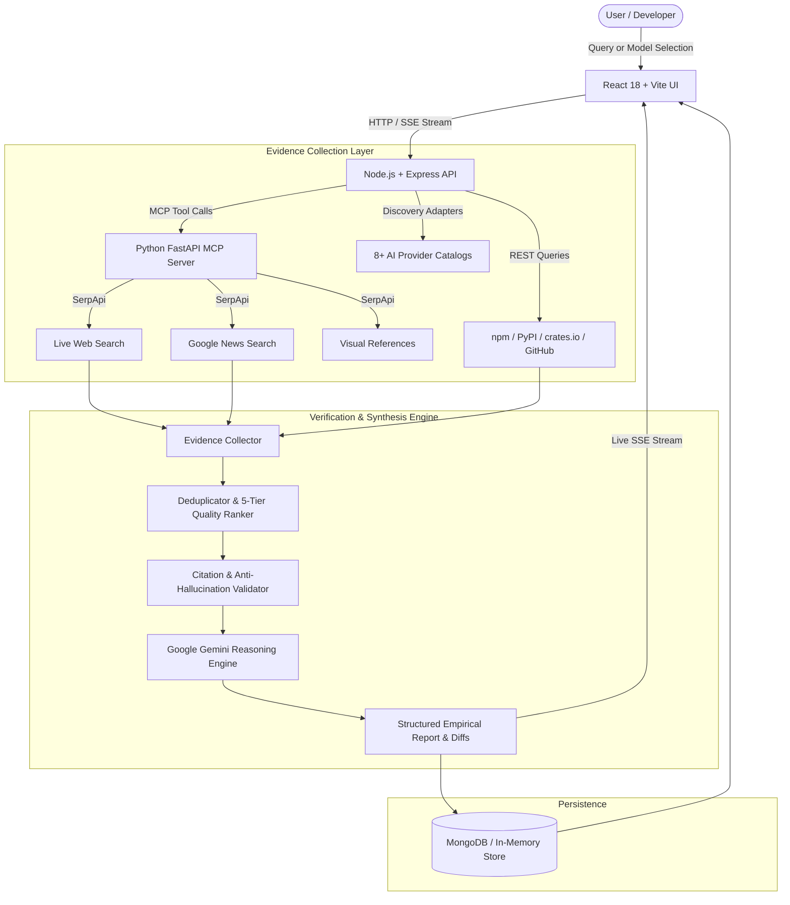

# 📚 Library Lens

> **Evidence-backed AI research assistant and empirical model intelligence engine powered by Google Gemini, the Model Context Protocol (MCP), and multi-source verification.**

---

## 🚀 Overview

**Library Lens** is an intelligent, full-stack research and decision-support platform designed for software engineers, architects, and technical leaders. Modern engineering teams waste hours evaluating libraries, validating software packages, and comparing rapidly evolving AI models against conflicting documentation, marketing claims, and outdated benchmarks.

Instead of relying on static AI memory or conversational models prone to hallucination, Library Lens pairs **Google Gemini as an evidence-driven reasoning engine** with a dedicated **Python Model Context Protocol (MCP) search layer** and direct registry crawlers. Every claim, capability metric, version number, release date, and architectural trade-off is strictly validated and tied to verifiable source URLs.

$$\text{\bf NO SOURCE = NO FACT}$$

---

## 🎯 Problem Statement

1. **AI Hallucinations in Technical Decisions**: Traditional LLMs frequently hallucinate APIs, recommend deprecated packages, invent release dates, and present inaccurate pricing or context limits.
2. **Rapid AI Model Velocity**: AI providers release, update, and deprecate models at an unprecedented rate. Teams struggle to objectively compare token pricing, context handling, and real-world capabilities across providers.
3. **Information Fragmentation**: Comparing two libraries or models requires checking dozens of browser tabs across GitHub changelogs, package registries (npm, PyPI, crates.io), provider pricing calculators, and community forums.
4. **Unverifiable Recommendations**: Most comparison tools declare arbitrary "winners" without verifiable empirical evidence or an audit trail.

---

## 💡 Solution

Library Lens enforces complete grounding and transparency:

- **Strict Source Grounding**: Every technical claim is cross-referenced with primary documentation, package registries, and official GitHub releases. If empirical evidence cannot be retrieved, the system explicitly reports: `Insufficient verified evidence found.`
- **Side-by-Side Empirical Comparison**: Side-by-side technical evaluation of AI models and software libraries, displaying exact context windows, token pricing ratios, capability matrices, and evidence counts.
- **Interactive Claim Auditing**: Users can challenge any synthesized statement or model recommendation to trigger targeted re-verification and counter-evidence retrieval.
- **Model Context Protocol (MCP) Architecture**: Live search tools (`web_search`, `news_search`, `images_search` via SerpApi) are decoupled into a dedicated Python MCP service.
- **Resilient Fallback Persistence**: MongoDB caching with an automatic, zero-config in-memory database fallback if MongoDB is not running locally.

---

## ✨ Key Features

- 🔍 **Multi-Source Evidence Research**: Real-time technical investigation querying official documentation, GitHub releases, changelogs, and package registries.
- 🤖 **Empirical AI Model Comparison**: Side-by-side evaluation of AI models (e.g., Gemini 2.5 Flash vs. Claude 3.5 Sonnet vs. GPT-4o) comparing context limits, context ratios, 1M token input/output pricing, shared vs. unique capability diffs, and evidence citations.
- 📡 **Model Context Protocol (MCP) Layer**: Decoupled Python FastAPI MCP server exposing standard MCP tools (`web_search`, `news_search`, `images_search` via SerpApi) to the Node.js backend.
- 🛡️ **Citation Validation & Anti-Hallucination Filter**: Automated validation pipeline that purges unverified citations or mismatched assertions before rendering.
- ⚖️ **Interactive Claim Challenge**: One-click claim auditing that initiates targeted counter-searches to verify, qualify, or refute specific assertions.
- 🎯 **AI Model Recommendation Engine**: Natural language requirements analyzer that extracts constraints (modality, latency, context size, budget) and scores candidates with counter-evidence verification.
- 🔄 **Autonomous Model Radar & Provider Sync**: Background scheduler monitoring 8+ AI provider registries (Google, OpenAI, Anthropic, Mistral, Groq, OpenRouter, Cohere, Together) to detect new, updated, and deprecated models.
- ⚡ **Real-Time Progress Streaming (SSE)**: Authentic Server-Sent Events updating frontend users step-by-step through search queries, registry fetches, and Gemini synthesis.
- 📦 **Dynamic Multi-Ecosystem Detection**: Automatically resolves npm, PyPI, and crates.io packages with built-in typo suggestion (e.g., `FastAPi` $\rightarrow$ `FastAPI`, `Reac` $\rightarrow$ `React`).
- 💾 **Resilient Dual-Tier Persistence**: Production MongoDB caching with zero-configuration fallback to an embedded in-memory database.
- 📑 **Version History & Step Replay**: Tracks research report revisions over time and enables stepping through intermediate research artifacts.
- 📤 **Export & Multi-Format Sharing**: Markdown export, PDF print-optimized stylesheet, clipboard copy, and persistent deep links (`/?id=...`).

---

## 🧠 How It Works



### Complete Workflow

1. **Submission**: The user submits two software libraries or selects two AI models, optionally adding architectural constraints or target use cases.
2. **Query Planning & Ecosystem Resolution**: The query planner normalizes names, determines the target ecosystem (`npm`, `PyPI`, or `crates.io`), and generates targeted search queries.
3. **Concurrent Evidence Collection**: The backend concurrently queries package registries, GitHub release tags, and the Python MCP service (`web_search`, `news_search`).
4. **Deduplication & Quality Tiering**: Sources are deduplicated and classified into the 5-Tier Source Quality Hierarchy.
5. **Gemini Synthesis**: Validated evidence snippets and metadata are supplied to Google Gemini with strict anti-hallucination prompt instructions.
6. **Citation Audit**: Citations in the generated content are matched against retrieved sources; uncited assertions are flagged or removed.
7. **Storage & Streaming**: The final report is cached and streamed in real-time to the React client via Server-Sent Events.

---

## 🏗️ System Architecture

### 1. Frontend
- **Framework**: React 18, Vite, TypeScript.
- **Styling**: Tailwind CSS with custom glassmorphism, responsive two-column layouts, and dark mode palette.
- **Interactive Components**: `ModelCompareModal`, `ModelRadar`, `ModelRecommendationView`, `ClaimChallengeModal`, `ReportView`, `EvidenceGraph`, `Hero`, `Navbar`, and `Sidebar`.
- **State & Streaming**: Custom hooks (`useTheme`), Server-Sent Events client for real-time progress.

### 2. Backend
- **Framework**: Node.js, Express, TypeScript (executed via `tsx` in development).
- **Research Orchestration**: Specialized modules for research orchestration (`planner`, `analyzer`, `orchestrator`, `normalizer`), evidence management (`collector`, `deduplicator`, `ranker`, `cross_checker`), and citation validation.
- **Model Intelligence**: Background scheduler (`modelScheduler`), concurrency-limited research queue, and recommendation engine.

### 3. AI / ML Components
- **Reasoning Engine**: Google Gemini API (`@google/generative-ai`) for evidence extraction, neutral trade-off analysis, claim verification, and requirement-to-model matching.

### 4. APIs & Endpoints
- **Research**: `/api/research` (initiate, retrieve, refresh, list history, delete, view sources, inspect evidence, challenge claims, review versions, replay steps).
- **Libraries**: `/api/library/:name` (package registry metadata), `/api/library/:name/releases` (GitHub release notes and tags).
- **AI Models**: `/api/models` (list, details, history, force research), `/api/models/radar` (provider health and sync stats), `/api/models/compare` (side-by-side empirical comparison), `/api/models/recommendations` (analyze, challenge, refresh, saved use cases).
- **Health**: `/api/health` (MongoDB, MCP server, and Gemini API diagnostics).
- **Streaming**: `/api/research/stream/:id` (Server-Sent Events).

### 5. Database
- **Primary**: MongoDB via Mongoose.
- **Fallback**: Automatic in-memory database store when MongoDB is unavailable, ensuring zero downtime for local testing.

### 6. External Services
- **Google Gemini API**: Synthesis and reasoning engine.
- **SerpApi via Python MCP**: Live search engine queries (Google Light, Google News, Google Images).
- **Package Registries**: npm Registry, PyPI JSON API, crates.io API.
- **GitHub REST API**: Release tags, published dates, and changelogs.
- **AI Provider Catalogs**: Discovery adapters for Google, OpenAI, Anthropic, Mistral, Groq, OpenRouter, Cohere, and Together AI.

---

## 🛠️ Tech Stack

| Technology | Purpose |
| :--- | :--- |
| **React 18** | Frontend user interface and component architecture |
| **Vite** | Development server and production bundling |
| **TypeScript** | Type safety across frontend, backend, and shared domain models |
| **Tailwind CSS** | Styling, glassmorphic UI components, and dark theme |
| **Node.js & Express** | Core API gateway, research orchestration, and provider management |
| **Google Gemini API** | Evidence-grounded synthesis, trade-off analysis, and reasoning |
| **Python 3.10+ & FastAPI** | Model Context Protocol (MCP) server wrapping search tools |
| **SerpApi** | Live search engine queries (Google Light, Google News, Google Images) |
| **Mongoose & MongoDB** | Persistence for research reports, model telemetry, and recommendations |
| **Vitest** | Automated backend unit and integration testing suite |
| **Framer Motion & Lucide** | Micro-interactions, transitions, and iconography |

---

## 📁 Project Structure

```text
Library_Lens/
├── .env.example                  # Environment configuration template
├── .gitignore                    # Excluded dependencies, builds, and keys
├── package.json                  # Root orchestration scripts (concurrent runner)
├── README.md                     # Project documentation
│
├── frontend/                     # React + Vite + TypeScript Frontend
│   ├── index.html                # Single-page application HTML entry
│   ├── package.json              # Frontend dependencies and Vite scripts
│   ├── tailwind.config.js        # Theme tokens, fonts, and extensions
│   ├── tsconfig.json             # TypeScript configuration for React
│   ├── vite.config.ts            # Vite bundler configuration & backend proxy
│   └── src/
│       ├── App.tsx               # Root view router and modal controllers
│       ├── index.css             # Base styles, Tailwind directives, custom scrollbars
│       ├── main.tsx              # React DOM entry point
│       ├── components/           # UI components
│       │   ├── ModelCompareModal.tsx       # AI Model Empirical Comparison UI
│       │   ├── ModelRadar.tsx              # Model discovery radar & provider stats
│       │   ├── ModelRecommendationView.tsx # Requirements-based recommender
│       │   ├── ClaimChallengeModal.tsx     # Interactive claim audit modal
│       │   ├── EvidenceGraph.tsx           # Visual evidence relationship display
│       │   ├── ReportView.tsx              # Library research comparison report
│       │   ├── Hero.tsx                    # Multi-mode research submission bar
│       │   ├── Navbar.tsx                  # Top navigation & system status
│       │   ├── Sidebar.tsx                 # Navigation between research & model tabs
│       │   └── ...
│       ├── hooks/                # Custom React hooks (e.g., useTheme)
│       ├── services/             # API clients and SSE streaming consumers
│       ├── types/                # Domain models, API responses, and evidence types
│       └── utils/                # Date formatting and source freshness evaluators
│
├── backend/                      # Node.js + Express + TypeScript Backend
│   ├── package.json              # Backend dependencies and TS scripts
│   ├── tsconfig.json             # Backend TypeScript configuration
│   └── src/
│       ├── server.ts             # Express server bootstrap and scheduler starter
│       ├── api/routes/           # Route definitions (research, models, libraries, health)
│       ├── controllers/          # Controllers for research, model catalog, recommendations
│       ├── evidence/             # Evidence collector, deduplicator, ranker, cross-checker
│       ├── gemini/               # Gemini AI reasoning and prompt synthesis engine
│       ├── mcp/                  # MCP client interface and registry fallback tools
│       ├── models/               # MongoDB Mongoose schemas, DAOs, and in-memory store
│       │   ├── providers/        # 8+ AI provider discovery adapters
│       │   ├── ai_model.schema.ts
│       │   ├── recommendation.schema.ts
│       │   └── research.schema.ts
│       ├── research/             # Orchestrator, query planner, and name normalizer
│       ├── services/             # Discovery service, recommendation engine, research queue
│       ├── tests/                # Vitest automated test suite
│       └── utils/                # Structured logger and freshness calculators
│
└── mcp-server/                   # Python Model Context Protocol (MCP) Server
    ├── requirements.txt          # Python dependencies (FastAPI, uvicorn, serpapi)
    ├── server.py                 # FastAPI MCP application (runs on port 5005)
    ├── schemas/                  # Pydantic schemas for search requests & MCP protocols
    └── tools/                    # SerpApi search tools (web_search, news_search, images_search)
```

---

## ⚙️ Installation

### Prerequisites
- **Node.js**: $\ge$ 18.0.0
- **Python**: $\ge$ 3.10
- **npm**: $\ge$ 9.0.0
- *(Optional)* **MongoDB**: Local daemon or MongoDB Atlas URI (falls back to in-memory store if not present)

---

### Step 1: Clone Repository & Create Environment File

```bash
git clone https://github.com/SyedAman1907/Library_Lens.git
cd Library_Lens
cp .env.example .env
```

---

### Step 2: Install Node Dependencies

Install all root, backend, and frontend dependencies:

```bash
# Using root convenience script:
npm run install:all

# Or manually:
npm install
cd backend && npm install
cd ../frontend && npm install
cd ..
```

---

### Step 3: Setup Python MCP Virtual Environment

#### On Windows (PowerShell):
```powershell
cd mcp-server
python -m venv .venv
.\.venv\Scripts\activate
pip install -r requirements.txt
cd ..
```

#### On Linux / macOS:
```bash
cd mcp-server
python3 -m venv .venv
source .venv/bin/activate
pip install -r requirements.txt
cd ..
```

---

## 🔐 Environment Variables

Configure the following variables in the root `.env` file. **Never expose real API keys or tokens in public commits.**

| Variable | Purpose | Required |
| :--- | :--- | :--- |
| `PORT` | Port for the Express backend server (default: `5000`) | Optional |
| `NODE_ENV` | Application environment (`development` / `production`) | Optional |
| `CLIENT_URL` | Allowed origin for frontend CORS (default: `http://localhost:5173`) | Optional |
| `MCP_SERVER_URL` | URL of the Python MCP server (default: `http://127.0.0.1:5005`) | **Required** (for MCP search tools) |
| `SERPAPI_API_KEY` | SerpApi key for live Google Light, News, and Image research | **Required** (for live web search) |
| `GEMINI_API_KEY` | Google Gemini API key for evidence synthesis & reasoning | **Required** (for AI synthesis) |
| `GOOGLE_API_KEY` | Google AI provider discovery & live catalog health checks | Optional |
| `OPENAI_API_KEY` | OpenAI provider discovery adapter | Optional |
| `ANTHROPIC_API_KEY` | Anthropic provider discovery adapter | Optional |
| `MISTRAL_API_KEY` | Mistral AI provider discovery adapter | Optional |
| `GROQ_API_KEY` | Groq provider discovery adapter | Optional |
| `OPENROUTER_API_KEY` | OpenRouter multi-provider discovery adapter | Optional |
| `COHERE_API_KEY` | Cohere provider discovery adapter | Optional |
| `TOGETHER_API_KEY` | Together AI provider discovery adapter | Optional |
| `MODEL_SYNC_INTERVAL_HOURS` | Interval in hours for background model catalog sync (default: `6`) | Optional |
| `MAX_MODEL_RESEARCH_CONCURRENCY` | Maximum concurrent background model research jobs (default: `2`) | Optional |
| `MODEL_FRESH_HOURS` | Freshness evaluation window for model telemetry in hours (default: `24`) | Optional |
| `MODEL_AGING_HOURS` | Aging threshold before model data is flagged as stale in hours (default: `72`) | Optional |
| `MONGODB_URI` | MongoDB connection URI (falls back to in-memory store if unset/offline) | Optional |
| `GITHUB_TOKEN` | GitHub personal token to raise API rate limits from 60 to 5,000 req/hr | Optional |

---

## ▶️ Running the Project

### Option A: Run All Services Concurrently (Recommended)

From the project root:

```bash
npm run dev
```

*This launches the Python MCP server, the Express backend, and the Vite frontend concurrently using `concurrently`.*

---

### Option B: Run Services Individually

Open three separate terminals:

**Terminal 1 — Python MCP Server:**
```bash
cd mcp-server
# Windows:
.\.venv\Scripts\python.exe server.py
# Linux/macOS:
source .venv/bin/activate && python server.py
# Running on http://127.0.0.1:5005
```

**Terminal 2 — Express Backend:**
```bash
cd backend
npm run dev
# Running on http://localhost:5000
```

**Terminal 3 — React Frontend:**
```bash
cd frontend
npm run dev
# Running on http://localhost:5173
```

Open `http://localhost:5173` in your browser.

---

## 🧪 Example Usage

### 1. AI Model Empirical Comparison
The application features a dedicated side-by-side empirical comparison view:

1. **Open Comparison Modal**: Navigate to the **Model Radar** tab or click **Compare** on any model card in the dashboard.
2. **Select Model A**: Pick the baseline model from the dropdown (e.g., `[GOOGLE] Gemini 2.5 Flash`).
3. **Select Model B**: Pick the comparison model from the second dropdown (e.g., `[GOOGLE] Gemini 2.5 Pro`).
4. **Run Empirical Comparison**: The system executes `POST /api/models/compare` with both model identifiers.
5. **Inspect Side-by-Side Metrics**:
   - **Context Window Ratio**: Displays exact token limits (e.g., `1.0M vs 1.0M`) and calculated ratio (`Ratio: 1.00x`).
   - **Token Pricing**: Compares Input Pricing and Output Pricing per 1M tokens side-by-side.
   - **Capabilities Diff**: Visual breakdown of shared capabilities (e.g., Text, Streaming, Long Context) vs. unique capabilities present exclusively in Model A or Model B.
   - **Evidence Citations**: Compares verified evidence citations retrieved for both models.
6. **Analyze Model Fit**: Use telemetry cards and overview descriptions to make informed architectural selections based on verified specs rather than marketing claims.

---

### 2. Software Library Research
1. Enter **Library A** (e.g., `Zustand`) and **Library B** (e.g., `Redux Toolkit`).
2. Specify an optional **Use Case** (e.g., `High-frequency state updates in an electron desktop app`).
3. Click **Research**.
4. Watch the real-time SSE progress stream gather package metadata, inspect GitHub release tags, run web searches via MCP, and synthesize the grounded report.
5. Review objective trade-offs, architecture comparisons, and verified citation badges. Click **Audit / Challenge Claim** on any assertion to verify against primary sources.

---

## 📊 Evaluation / Comparison

The application provides objective, empirical comparisons across two major domains:

### 1. AI Model Comparison Metrics
- **Context Window Limits & Ratio**: Evaluates maximum context window sizes and computes the numerical scale factor ($Ratio = \frac{\text{Context}_A}{\text{Context}_B}$).
- **Token Pricing per 1M Tokens**: Evaluates standard input and output token costs based on published provider pricing.
- **Capabilities Matrix**: Computes set intersection and set differences:
  - $\text{Shared} = \text{Caps}_A \cap \text{Caps}_B$
  - $\text{Unique to A} = \text{Caps}_A \setminus \text{Caps}_B$
  - $\text{Unique to B} = \text{Caps}_B \setminus \text{Caps}_A$
- **Lifecycle & Provider Status**: Categorizes models as `NEW`, `UPDATED`, `ACTIVE`, or `DEPRECATED`.
- **Evidence Count**: Quantifies verified documentation citations backing each model's capability claims.

### 2. Software Library Comparison Metrics
- **Registry Telemetry**: Compares published version, release dates, weekly download numbers, and license types.
- **Source Quality Classification**: Evaluates each supporting source against a 5-tier credibility hierarchy.
- **Freshness Scoring**: Flags documentation as *Fresh* (< 6 months), *Recent* (< 1 year), *Older* (< 2 years), or *Potentially Stale*.
- **Claim Challengeability**: Every synthesized fact provides an audit trail back to its originating HTTP source URL.

---

## 🏆 Hackathon Value

- **Solves a Universal Problem**: Developers make critical architectural choices using outdated blog posts, biased benchmarks, and hallucinated LLM advice. Library Lens grounds technical decisions in verifiable reality.
- **True Multi-Model & MCP Architecture**: Demonstrates practical adoption of the Model Context Protocol (MCP) to decouple live search tools from core business logic.
- **Zero Hallucination Tolerance**: Eliminates "black box" claims through programmatic citation validation and interactive claim challenge workflows.
- **Production-Grade Resilience**: Built with automatic in-memory fallback stores, asynchronous concurrency queues, and real-time streaming interfaces.

---

## 🔮 Future Scope

The following capabilities represent planned enhancements:

- [ ] **Automated Head-to-Head Benchmark Execution**: Running live coding/reasoning prompts against Model A and Model B in real-time to compute empirical latency and token generation rates.
- [ ] **Self-Hosted LLM Provider Adapters**: Local Ollama and vLLM discovery adapters for air-gapped on-premise model comparisons.
- [ ] **CI/CD Breaking Change Linter**: GitHub Action to audit dependencies in pull requests against Library Lens breaking change radar.
- [ ] **Collaborative Workspace Teams**: Multi-user shared research collections and team-wide architectural decision records (ADRs).

---

## ⚠️ Limitations

- **API Rate Limits**: Package registry lookups and GitHub API queries are subject to upstream rate limits (mitigated by configuring `GITHUB_TOKEN`).
- **SerpApi Dependency**: Live web and news searches require an active SerpApi connection and API credits.
- **Provider Pricing Currency**: Model pricing data reflects values ingested from provider documentation at synchronization time and may lag unannounced intraday price cuts.
- **Browser-Only LLM Inference**: The current model comparison compares documented empirical specifications and metadata rather than executing live client-side inference queries against both models simultaneously.

---

## 🔒 Security

- **Server-Side API Key Isolation**: All third-party credentials (`SERPAPI_API_KEY`, `GEMINI_API_KEY`, provider keys) are restricted to backend execution and are never sent to the client browser.
- **Log Sanitization**: The structured logger automatically scrubs sensitive keys, tokens, and database passwords before outputting logs.
- **Safe External Navigation**: All outbound source links use `rel="noopener noreferrer"` attributes to prevent tab-nabbing vulnerabilities.
- **Input Validation**: API parameters and search queries are strictly validated using Zod schemas and query sanitizers.
- **Repository Safety**: `.env` files are excluded by `.gitignore`.

---

## 📸 Screenshots

Screenshots will be added here.

---

## 🎥 Demo

| Resource | Link |
| :--- | :--- |
| **Demo Video** | *[Add demo link]* |
| **Live Demo** | *[Add deployment link]* |
| **GitHub** | [https://github.com/SyedAman1907/Library_Lens](https://github.com/SyedAman1907/Library_Lens) |

---

## 👤 Team

**Syed Aman Mirzanullah** — Project Lead & Full-Stack Architecture

---
## 📄 License

This project is licensed under the [MIT License](package.json).

---

## ⭐ Final Section

**Library Lens brings empirical rigor to AI-assisted software engineering — transforming generative AI from an unreliable memory bank into a verifiable, evidence-grounded research partner.**
